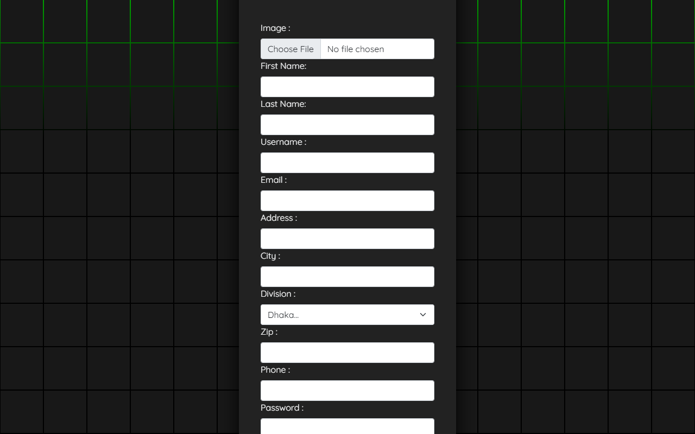
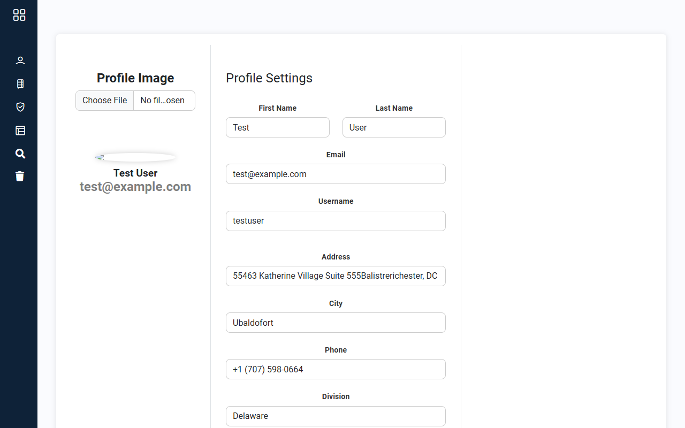
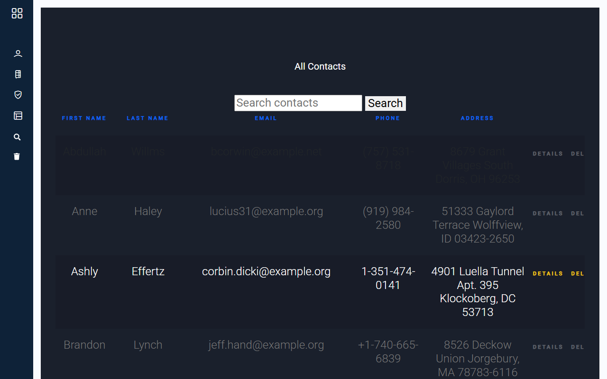
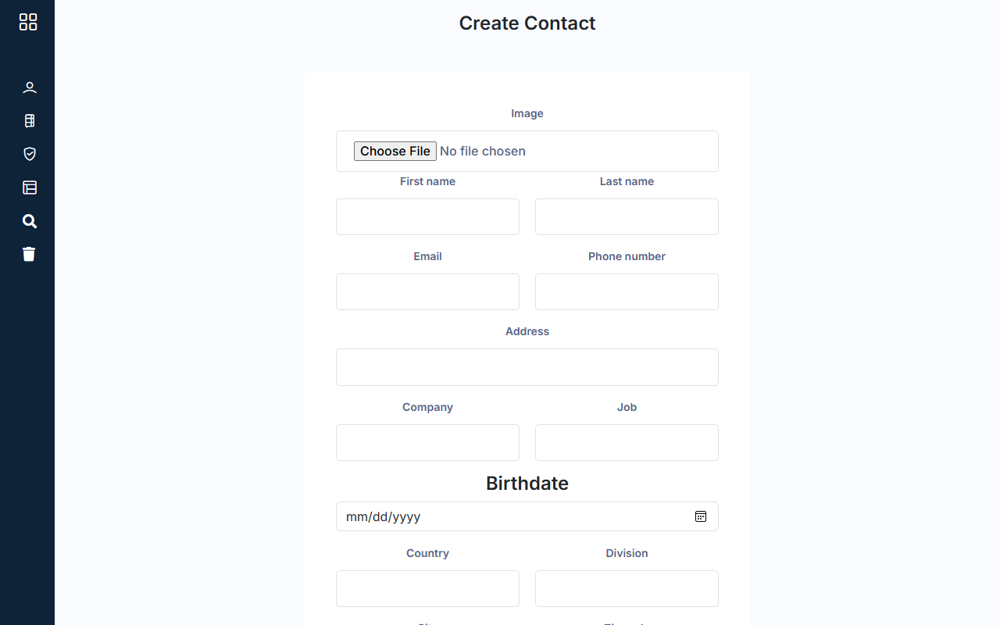
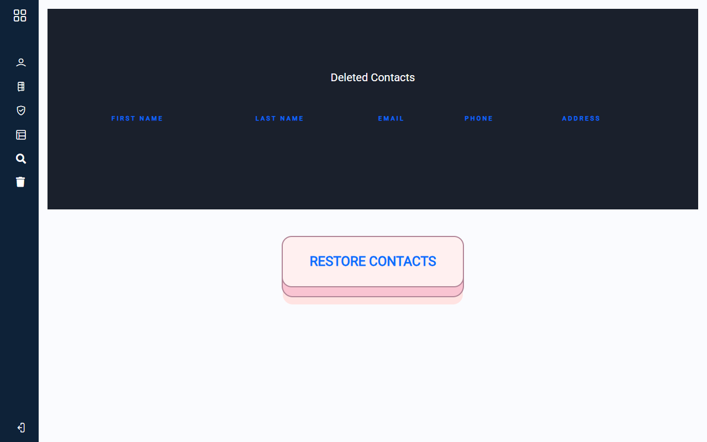
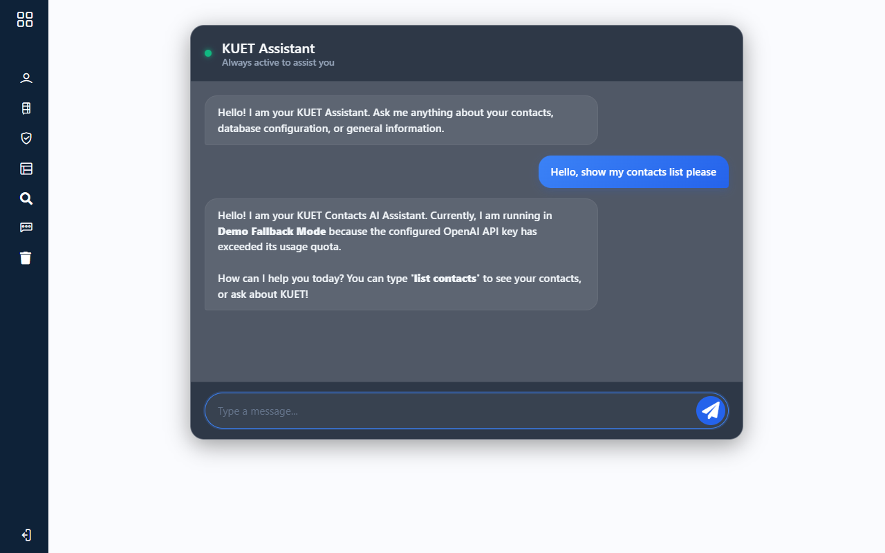

# KUET Contacts Application

<p align="center">
<a href="https://github.com/laravel/framework/actions"></a>
<a href="https://packagist.org/packages/laravel/framework"></a>
<a href="https://packagist.org/packages/laravel/framework"></a>
<a href="https://packagist.org/packages/laravel/framework"></a>
</p>

A Laravel-based contacts directory and management system designed to provide a secure interface for managing user profiles and contact relationships. The application features user authentication with rate limiting, soft deletion safety nets, dynamic live search filtering, data import/export support, payment gateway routes, and artificial intelligence integration.

---

## Quick Start & Live Demo Guide

To run and view the website locally in under a minute, follow these steps:

### 1. Run the Local Server
If using the included portable PHP binaries, start the server by running this command in your terminal:
```bash
php_bin/php.exe artisan serve --port=8181
```

### 2. Login Credentials
Once the server is running, navigate to **[http://127.0.0.1:8181/login](http://127.0.0.1:8181/login)** and use the following pre-seeded test credentials:
* **Username**: `testuser`
* **Email**: `test@example.com`
* **Password**: `1234`

### 3. AI Chat Setup (Free Option)
The application has a smart fallback AI chat assistant. To enable live AI responses:
1. Get a free API key from **[Groq Console](https://console.groq.com/)** or **[OpenRouter](https://openrouter.ai/)**.
2. Add the key to your `.env` file:
   ```env
   GROQ_API_KEY=your_groq_key_here
   # OR
   OPENROUTER_API_KEY=your_openrouter_key_here
   ```

---

## Application Screenshots and Media

The repository contains interface captures and product demonstration videos located under the root directory of the repository.

### User Authentication


### Profile Management


### Contacts Directory


### Create Contact Page


### Trash Management


### AI Chat Assistant


### Interactive Walkthrough Video
The file `website demo.mp4` (or `Chat_command.mp4`) contains a video walkthrough demonstrating navigation, contacts management, and profile features.

---

## Core Features

*   **Authentication & Access Control**: Implements user registration and login forms with custom request validation rules. The login portal uses throttling middleware to limit brute-force attempts.
*   **Profile Configuration**: Allows users to manage account details including name, email address, address info, and personal avatars.
*   **Contacts Directory Management**: Full CRUD operations for contacts, including records sorting by key fields.
*   **Soft Deletion Safeguards**: Deleted contacts are sent to a trash bin, where they can be restored or permanently removed.
*   **Asynchronous Contact Search**: A keyup-triggered search input filters the contact list instantly using AJAX requests that retrieve JSON records without reloading the page.
*   **Data Export and Import**: Exports the current contact list to an Excel spreadsheet and imports contacts using a formatted template spreadsheet.
*   **Payment Gateway Integration**: Sandbox routes configured for the SSLCommerz payment gateway, supporting checkout initialization and callback status pages.
*   **AI Integration**: Contains routes for querying OpenAI chat completions and Gemini API prompts to process context or perform requests.
*   **Web Search API**: Integration with the Serper API to perform Google search queries inside the application interface.

---

## Password Recovery Implementation

A secure, custom password reset flow has been implemented that generates unique reset tokens, sends them via email, and securely updates the user's password in the database.

### 1. Database Schema
A custom table `forgot_passwords` stores the relationship between a user's email and a unique reset token:
```php
Schema::create('forgot_passwords', function (Blueprint $table) {
    $table->id();
    $table->string('email');
    $table->string('token');
    $table->timestamps();
});
```

### 2. Routing (`routes/web.php`)
We define dedicated endpoints for request submission and execution:
```php
Route::get('/forgot_password', [ForgotPasswordManager::class, 'forgot_password'])->name('forgot_password.view');
Route::post('/forgot_password', [ForgotPasswordManager::class, 'forgot_passwordPost'])->name('forgot_passwordPost');
Route::get('/resetPassword/{token}', [ForgotPasswordManager::class, 'resetPassword'])->name('resetPassword');
Route::post('/resetPassword', [ForgotPasswordManager::class, 'resetPasswordPost'])->name('resetPasswordPost');
```

### 3. Controller Logic (`app/Http/Controllers/ForgotPasswordManager.php`)
* **`forgot_passwordPost(Request $request)`**: Validates the email address. Generates a random 30-character token using `Str::random(30)`, stores the record, and sends a recovery email with the reset link using Laravel's `Mail::send` facade.
* **`resetPasswordPost(Request $request)`**: Validates the new password with confirmation, validates that the email and token match an entry in the database, hashes the new password using `bcrypt()`, updates the user record, and deletes the used reset token.

### 4. Email Template (`resources/views/auth/email.blade.php`)
Constructs the password recovery email body containing a dynamic reset link:
```html
<p>To reset your password, click the following link: <a href="{{ route('resetPassword', $token) }}">Reset Password</a></p>
```

### 5. Mail Configuration (`.env` Setup)
To send reset emails, configure the mail server settings in your `.env` file:

* **For Local Testing (Log Driver)**:
  By default, emails are written directly to your local application log instead of being sent. This is recommended for local development to avoid configuring SMTP details:
  ```env
  MAIL_MAILER=log
  ```
  *(Check sent emails under `storage/logs/laravel.log`)*

* **For Real Email Transmission (e.g., Gmail SMTP)**:
  Update your `.env` with SMTP mail server credentials:
  ```env
  MAIL_MAILER=smtp
  MAIL_HOST=smtp.gmail.com
  MAIL_PORT=465
  MAIL_USERNAME=your_gmail_username@gmail.com
  MAIL_PASSWORD=your_gmail_app_password
  MAIL_ENCRYPTION=ssl
  MAIL_FROM_ADDRESS="your_gmail_username@gmail.com"
  MAIL_FROM_NAME="${APP_NAME}"
  ```
  > [!IMPORTANT]
  > When using Gmail SMTP, you must generate and use an **App Password** from your Google Account Security settings rather than your account's primary login password.

---

## Technical Stack and Architecture

### Technologies Used

*   **Backend Framework**: Laravel 11.x
*   **Programming Language**: PHP 8.2+
*   **Database**: SQLite (file-based local database) or MySQL
*   **Client-Side Libraries**: HTML5, CSS3, JavaScript, jQuery, Bootstrap 5.3, FontAwesome, LineIcons
*   **Assets Bundler**: Vite

### Key Dependencies

*   `gemini-api-php/laravel` - Laravel package wrapper for the Gemini API.
*   `openai-php/laravel` - Laravel package wrapper for OpenAI services.
*   `maatwebsite/excel` / `phpoffice/phpspreadsheet` - Used to read and generate Excel spreadsheet files.
*   `twilio/sdk` - SDK integration for SMS transmission capabilities.
*   `laravel/sanctum` - API token authentication system.

### Application Architecture

The system utilizes the Model-View-Controller pattern to separate logic, data modeling, and rendering:

*   **Models (`app/Models/`)**: Define database schemas and relationship maps (such as a User possessing many Contacts).
*   **Controllers (`app/Http/Controllers/`)**:
    *   `ContactsController`: Manages contact actions, search filtering, spreadsheet processing, and trash status.
    *   `AuthController`: Controls authentication flows and registration sequences.
    *   `ProfileController`: Handles profile details editing and file system uploads.
    *   `SslCommerzPaymentController`: Implements SSLCommerz gateway handshakes and webhook status callbacks.
*   **Middleware (`app/Http/Middleware/`)**: Includes `AuthGuard` to verify user sessions before allowing page accesses.
*   **Views (`resources/views/`)**: Modular Blade templates that inherit layouts and split visual components.
*   **Migrations (`database/migrations/`)**: Setup scripts defining structural rules for users, contacts, caches, jobs, and tokens.

---

## Laravel Development & Debugging Guide

Below are the development procedures, code snippets, and common debugging tips accumulated during the construction of this project.

### 1. Database Operations & Shell Interactions (Tinker)
Artisan Tinker allows you to interact with the Eloquent ORM directly from the command line interface:
```bash
# Start a Tinker session
php artisan tinker
```
Inside the interactive shell:
```php
// Create a User record
App\Models\User::factory()->create();

// Create 5 contacts for user_id = 1
App\Models\Contact::factory()->count(5)->create(['user_id' => 1]);

// Dispatch a background job
dispatch(new App\Jobs\ProcessPodcast);
```

### 2. Model Factories
Model factories are used to structure and generate mock testing data:
```bash
# Generate a new factory
php artisan make:factory UserFactory --model=User
```
Define model attributes in the factory's `definition()` method:
```php
public function definition(): array
{
    return [
        'first_name' => $this->faker->firstName,
        'email' => $this->faker->unique()->safeEmail,
    ];
}
```

### 3. Authentication & Facades
The `Auth` facade provides static interfaces to the application's authentication services:
```php
// Attempt login using validated credentials
$credentials = $request->only('email', 'password');

if (Auth::attempt($credentials)) {
    return redirect()->intended('dashboard');
}
```

### 4. Controller Redirects & Session Flash
Laravel provides multiple redirect helpers to handle request flows:
```php
// Redirect to a named route
return redirect()->route('home');

// Redirect back with old input (accessible in views via old('fieldname'))
return redirect()->back()->withInput();

// Store data in Session
session(['key' => 'value']);

// Flash message to Session
return redirect()->route('home')->with('status', 'Profile updated!');
```

### 5. Foreign Key Cascades in Migrations
To clean up child records when a parent user is deleted, define cascading constraints:
```php
public function up()
{
    Schema::create('contacts', function (Blueprint $table) {
        $table->foreignId('user_id')->constrained()->onDelete('cascade');
    });
}
```
*Note: Using `constrained()` without parameters automatically assumes primary key references `id` in the `users` table.*

### 6. Troubleshooting Common Errors

#### "419 Page Expired" (CSRF Token Missing)
Ensure all POST forms include the `@csrf` token directive:
```html
<form method="POST" action="/submit">
    @csrf
    <!-- fields -->
</form>
```
For jQuery AJAX requests, set up the headers to read the token:
```javascript
$.ajax({
    headers: {
        'X-CSRF-TOKEN': $('meta[name="csrf-token"]').attr('content')
    },
    // request configuration
});
```

#### "403 Unauthorized Action"
Ensure form requests have their authorization logic enabled:
```php
// In custom Request classes (e.g. CreateContactRequest)
public function authorize(): bool
{
    return true; // Set to true to authorize the request
}
```

### 7. Automated Middleware Testing
To write feature tests to verify access control middlewares:
```bash
# Create a test case
php artisan make:test AuthGuardTest
```
Write unit assertions using the `RefreshDatabase` trait:
```php
public function it_redirects_guests()
{
    $response = $this->get('/profile');
    $response->assertRedirect('/login');
}

public function it_allows_authenticated_users()
{
    $user = User::factory()->create();
    $response = $this->actingAs($user)->get('/profile');
    $response->assertOk();
}
```

### 8. Asynchronous Search (AJAX)
To dynamically filter contacts list during keyup search without triggering a full page reload:
```javascript
$('#search').on('keyup', function(e) {
    e.preventDefault();
    const query = $(this).val();
    $.ajax({
        url: "{{route('contacts.search')}}",
        type: "GET",
        data: {'query': query},
        success: function(data) {
            let rows = '';
            $.each(data, function(key, value) {
                rows += '<tr>';
                rows += '<td>' + value.first_name + '</td>';
                rows += '<td>' + value.last_name + '</td>';
                rows += '<td><a href="/contacts/' + value.id + '/edit">Details</a></td>';
                rows += '</tr>';
            });
            $('.custom-table tbody').html(rows);
        }
    });
});
```
